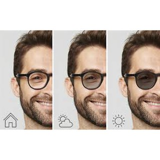
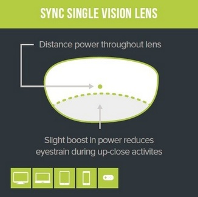

    

Uma outra alternativa que tem caído no gosto dos pacientes são as armações do tipo clip-on, ou seja, aquelas que permitem adicionar lentes com filtros escuros, marrons ou amarelos à armação. Com isso transformam os óculos tradicionais em óculos escuros ou filtrantes, conforme filtro adicionado.

#### Lentes Anti fatigue ou Lentes para Vida Digital
    

Esse modelo especial de lentes possui o grau de longe do paciente na parte superior das lentes proporcionando uma visão de longe adequada e uma adição variável de grau para perto na parte inferior das lentes com intuito de ajudar os músculos oculares a manter o foco para a visão de perto para quem fica muitas horas utilizando a visão de perto.   
Às vezes também utilizamos essas lentes para os pacientes que estão no início da presbiopia (“vista cansada”), quando ainda é possível utilizar o mesmo grau para intermediário e perto já que nessas lentes, não há essa distinção. 

  

#### Algumas informações importantes   
- sempre que for possível, traga seus óculos para conferência munido da sua receita e da garantia de sua lentes que foi fornecido pela óptica. 
- é bastante comum ter algum desconforto nos primeiros dias após a troca dos seus óculos, especialmente se houve mudança de grau ou do modelo das lentes. Após conferidos, tente utilizar nos próximos dias para que você possa se adaptar. 
- O que fazer se não estiver se adaptando mesmo com passar dos dias? 
O primeiro passo é dar ir até a óptica para reconferir o posicionamento dos óculos em seu rosto para que o óptico possa realizar ajustes. Normalmente isso resolve a grande maioria dos problemas de adaptação. 
No entanto, se isso não der certo, está na hora de voltar ao consultório para que possamos fazer uma revisão de todo o processo e tentar descobrir o motivo pelo qual você não está se adaptando. Nesse caso, é importante entrar em contato com nossa equipe e explicar o motivo, pois daremos total prioridade ao seu agendamento. E não deixe passar muito tempo, pois a maioria das lentes de boa qualidade têm de 30 a 90 dias de garantia de adaptação, ou seja, poderemos pedir alguma adequação de sua lente, sem custo para você (procure se informar sobre essa importante informação na hora da compra de seus óculos).

**Veja também**  

 [Como escolher a lente intraocular](/dica-lentes)    
   
  [Comos escolher seus óculos](/dica-oculos) 
   
 [⇦ voltar a pagina principal](/) 

----------------------------------------------------------------------------------------------------